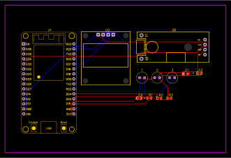

# google-dino-hacked

google dino game : https://dino-chrome.com/en

## Hack
Dino automatically jumps over cacti & ducks to the beat.

### Links to videos 
* https://youtu.be/JOFl63-6Mqc
* https://youtu.be/I-8QXEF8-pc

### How
1. Place the photoresistors in front of the screen, aligned with the future path of the dino
2. Place the microphone close to a source of music
3. Play some good beating music
4. Start the game by pressing space bar or arrow key up

## Electronics

- esp32
- 3 photoresistors
- 2 capacitors
  - 2 of 100nf
  - 1 of 440µf
- microphone vma309 (renamed WPSE309)
- oled monitor ssd1306 (128*64)

The esp32 
  - receives the signal from

components           |  title2
:-------------------------:|:-------------------------:
the 3 photoresistors:
   the first detects the first passage of the cactus, the second detects the second passage of the cactus, the third detects the state of the background (day/night) | cell2

    - the 3 photoresistors:
      - the first detects the first passage of the cactus
      - the second detects the second passage of the cactus
      - the third detects the state of the background (day/night)
  - calculates the interval between the 2 passages to get the speed
  - sends the keyboard command arrow up to make the dino jump
    - a microphone
  - sends the keyboard command arrow down to make the dino duck

### esp32
Please follow the instructions here to use correctly the ESP32:
https://randomnerdtutorials.com/installing-the-esp32-board-in-arduino-ide-windows-instructions/#:~:text=Installing%20ESP32%20Add%2Don%20in%20Arduino%20IDE&text=Open%20the%20Boards%20Manager.,installed%20after%20a%20few%20seconds.

I2C LCD Interface:
https://www.electronicshub.org/esp32-i2c-lcd/

then install bluetooth keyboard library :
https://github.com/T-vK/ESP32-BLE-Keyboard/releases#:~:text=ESP32%2DBLE%2DKeyboard.zip

When running on arduino, go to "Tools/serial plotter" to watch the signal coming from the photo-resistors 

### vma309
https://www.velleman.eu/products/view/?id=435532

### ssd1306
https://surplustek.ca/128x64-iic-spi-serie-blanc-ecran-oled-module-i2c-conseil-ecran-lcd-0-96-ssd1306-pour-arduino-stm32-51-oled-i2c

### capacitors
https://www.amazon.com/BOJACK-Ceramic-Capacitor-Assortment-Capacitors/dp/B07P7HRGT9/ref=sr_1_25?keywords=100nf+capacitor&qid=1653238245&sr=8-25
